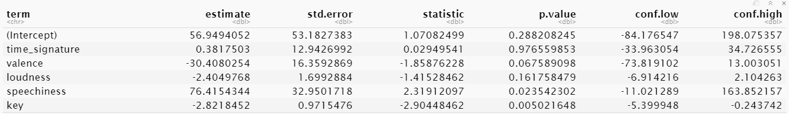
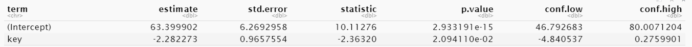

Final Report - Spotify and Billboard Rankings
================
Alison Palmer and Walter Villa
2020-12-15

  - [Purpose](#purpose)
  - [Background](#background)
  - [[Data](https://data.world/kcmillersean/billboard-hot-100-1958-2017/workspace/file?filename=Hot+100+Audio+Features.xlsx)](#data)
  - [Model](#model)
  - [Addition Observations](#addition-observations)
  - [Further Exploration and
    Questions](#further-exploration-and-questions)
  - [Project Repo](#project-repo)
  - [Sources](#sources)

## Purpose

What song attributes lead towards success on the Billboard charts?

## Background

Each year, new songs emerge and become some of the year’s top hits.
Whether it’s because of a viral video or a certain time of year, new
songs seem to become popular overnight. The Billboard charts are a place
in which songs and albums are ranked based on their weekly popularity in
the United States. The charts can be ranked in categories such as sales,
streams, or airplay. All three of these categories are used to compile
the Hot 100 song chart, including data that come from YouTube and other
video streaming sites.

In 2005, Billboard made the change to include paid digital downloads
from digital music retail stores like AmazonMP3 and iTunes. This meant
that a song was able to make it onto the charts based solely on digital
downloads. In 2007, it incorporated digital streams into the Top 100.
Over the years, Billboard’s methodology changed in ways that would allow
different types of genres to gain a position on the charts through
digital downloads and streaming plays. It’s most recent change has had
major impact in how songs were ranked on the billboard charts. This
change had to do with YouTube video streaming data, which enhanced a
formula that incorporates on-demand audio streaming and online radio
streaming. Billboard made this change in order to reflect the diverse
music consumption platforms of today’s day and age.

Spotify is a Swedish audio streaming and media services provider. Having
come out in the early 2000’s, it offers millions of digital copyright
music and podcasts. While free service allows you to listen to songs
alongside advertisements, paid subscriptions offer easier accessibility
and more features for users. People from all around the world are able
to listen to the latest trending songs on the platform. Interestingly
enough, Spotify stores certain features for different songs, which is
useful information for noticing certain trends in the type of songs that
perform a certain way. On January 3, 2020, Billboard made the decision
to count the popularity of official music videos on YouTube, as well as
on streaming platforms like Apple Music, Spotify, Tidal, and Vevo into
the Billboard 200, according to the New York Times. As a group, we
wanted to investigate any potential patterns or trends in songs landing
on the Billboard charts in correlation to Spotify’s top tracks.

## [Data](https://data.world/kcmillersean/billboard-hot-100-1958-2017/workspace/file?filename=Hot+100+Audio+Features.xlsx)

Our data is composed of Spotify’s top songs by year in the world and top
songs ranked on the Billboard charts. The Spotify dataset contains
several variables corresponding to each song’s features (i.e genre, bpm
\[beats per minute\], energy, liveness, etc) defined by Spotify itself.
The Billboard dataset contains values from each track pulled from the
Spotify Web API to be able to have information on each track listed on
the Billboard charts.

Song Terminology

  - Danceability: describes how suitable a track is for dancing. Based
    on: tempo, rhythm stability, beat strength, and overall regularity.
    Value: 0.0 - 1.0 (0 = least danceable, 1 = most danceable)

  - Energy: represents a perceptual measure of intensity and activity.
    High energy tracks feel fast, loud, noisy. Death Metal (high
    energy), Bach prelude (low energy)

  - Loudness: describes how loud a song is. Determined by decibel count
    (db)

  - Valence: describes the musical positiveness conveyed by a track.
    Tracks with high valence sound more positive (e.g happy, cheerful,
    euphoric), while tracks with low valence sound more negative (e.g
    sad, depressed, angry).

  - Acoustic: a confidence measure of 0.0 to 1.0 of whether the track is
    acoustic.

  - Duration: the duration of the track in seconds.

  - Speechiness: detects the presence of spoken words in a track.

  - Key: the group of pitches or scales that form the basis of the song.

  - Time Signature: the number of beats per measure and which note value
    is equivalent to a beat

Background on Billboard dataset:

  - songid: song title+ performer

  - performer: the artist

  - song: song title

  - Spotify\_genre: genre of song (this is put into a list)

  - Spotify\_track\_id: track ID

  - Spotify\_track\_preview\_url: URL for track

  - Spotify\_track\_album: album name

  - Spotify\_track\_explicit: boolean of whether or not a track

  - instance: \# of times a song ID has appeared on chart after dropping
    off the chart for at least a week.

  - previous \_week\_position: previous chart position for a song for
    that week.

  - peak\_position: highest position for a song id for that given week.
    NOTE: It is not the overall highest peak position

  - weeks\_on\_chart: number of weeks on the chart for a song id for
    that given week. NOTE: It is not the overall running count of weeks.

## Model

For our model, we decided to use a linear regression model to predict
the placement of songs on the Billboard top 100 charts based off of
their attributes. We filtered the initial dataset to only include one
instance of each song at it’s peak position on the charts. We then
plotted peak\_position versus a variety of song attributes. From the
initial analysis, there was no clear factor that predicted peak position
of a song.

We split the dataframe into two random dataframes for training the model
and validating the model. After evaluating all of the factors by running
a linear regression model and plotting peak position vs the factors, we
determined time signature, valence, loudness, speechiness, and key were
the most likely factors to contribute to peak position.

*Null Hypothesis Testing*

Null Hypothesis: There is no correlation between song attributes and
placement on the Billboard Top 100 Charts.

Alternate Hypothesis: There is a non-zero correlation between song
attributes and placement on the Billboard Top 100 Charts.

After running our model, we got the following confidence intervals for
the factors.  As you can see, all of the
confidence intervals cross 0 except for key.

When the model is run only using key as a predicting factor, key’s
confidence interval does cross zero. This indicates key isn’t a solid
indicator for peak position. There is not substantial evidence to
disprove our null hypothesis.

We then plotted the actual Peak Position on the Billboard Charts versus
the Predicted Peak Position. The data has been filtered to only show the
top 10 songs for clarity. The trend persisted for the entire top 100.

## Addition Observations

*Tempo*

When looking at how tempo impacted the peak position of songs, we
noticed two outliers. These songs had the highest tempo of all of the
songs in the dataset. We determined that these two songs were Heart by
Kenny Chandler and Tuff by Ace Cannon. Both of these songs were released
in the early 60s. The tempo of Heart was 241 while Tuff was 233. The
next highest tempo was 216. Ace Cannon was a saxophonist and Tuff
reached \#3 on the R\&B Charts. Heart is a rock and funk/soul track.
This surprised us because we associate higher tempo songs with more
modern music. *Side note: I recommend listening to Heart. It’s a really
interesting sounding song.*

*Explicit Songs*

When digging into peak position for different songs over the years with
relation to the explicitness of the song, it was interesting to see that
most of the songs that peaked at Number 1 on the Billboard charts were
not considered explicit (using Spotify’s categorization). We looked at
the most recent year that we had data on (2019) and went back 10 years
to see if there was any sort of change in the amount of explicit songs.
Interestingly enough, a majority of the peak position songs were mainly
non-explicit, with only a few explicit songs peaking at number 1 in the
year 2019. Zooming out, we also looked at top 5 songs, and they drew in
a similar conclusion: Most songs that peaked in the top 5 were
non-explicit songs, while only a handful were considered explicit.

## Further Exploration and Questions

Because our project is scoped carefully for 2 weeks of investigation, we
were limited in addressing and exploring some questions that we had.
While we investigated the song attributes that contributed to the
success of the billboard rankings, our results intrigued our interest in
certain subtopics that may allow us to see a trend within our data.
Looking at ‘time of year’ as a factor for how songs were ranked may give
us insight as to why certain songs ended up ranking top 10 during a
certain period of time. Looking at the correlation between months and
what was happening around the world (major world events, popular social
media trends, etc.) may also allow us to have a better understanding of
how certain songs gained popularity. In addition, we are interested in
potentially observing how different streaming services may impact the
rankings of these songs. Because Billboard has made changes in how they
evaluate “top” songs, looking at that information may also expand our
knowledge into other factors that may determine popularity. Ultimately,
we would like to tap into other methods to see any other potential
factors that may cause an increase in popularity and, therefore, a shot
at a top ranking on the Billboard charts.

## Project Repo

<https://github.com/notwaltervilla/spotifyDataScienceFinalProject>

## Sources

  - [Spotify Wikipedia](https://en.wikipedia.org/wiki/Spotify)
  - [NYT](https://www.nytimes.com/2019/12/13/arts/music/billboard-youtube-charts.html#:~:text=low%20royalty%20payments.-,Starting%20Jan.,Hot%20100%2C%20since%202013)
  - [Billboard
    Wikipedia](https://en.wikipedia.org/wiki/Billboard_Hot_100)
  - [Towards Data
    Science](https://towardsdatascience.com/what-makes-a-song-likeable-dbfdb7abe404)
