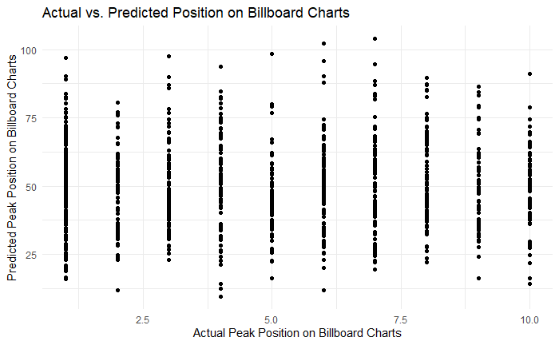

Final Report - Spotify and Billboard Rankings
================
Alison and Walter Villa
2020-12-15

  - [Purpose:](#purpose)
  - [Background:](#background)
  - [Data:](#data)
  - [Model](#model)
  - [Addition Observations](#addition-observations)

## Purpose:

What song attributes lead towards success on the Billboard charts?

## Background:

Each year, new songs emerge and become some of the year’s top hits.
Whether it’s because of a viral video or a certain time of year, new
songs seem to become popular overnight. The Billboard charts are a place
in which songs and albums are ranked based on their weekly popularity in
the United States. The charts can be ranked in categories such as sales,
streams, or airplay. All three of these categories are used to compile
the Hot 100 song chart, including data that come from YouTube and other
video streaming sites.

In 2005, Billboard made the change to include paid digital downloads
from digital music retail stores like AmazonMP3 and iTunes. This meant
that a song was able to make it onto the charts based solely on digital
downloads. In 2007, it incorporated digital streams into the Top 100.
Over the years, Billboard’s methodology changed in ways that would allow
different types of genres to gain a position on the charts through
digital downloads and streaming plays. It’s most recent change has had
major impact in how songs were ranked on the billboard charts. This
change had to do with YouTube video streaming data, which enhanced a
formula that incorporates on-demand audio streaming and online radio
streaming. Billboard made this change in order to reflect the diverse
music consumption platforms of today’s day and age.

Spotify is a Swedish audio streaming and media services provider. Having
come out in the early 2000’s, it offers millions of digital copyright
music and podcasts. While free service allows you to listen to songs
alongside advertisements, paid subscriptions offer easier accessibility
and more features for users. People from all around the world are able
to listen to the latest trending songs on the platform. Interestingly
enough, Spotify stores certain features for different songs, which is
useful information for noticing certain trends in the type of songs that
perform a certain way. On January 3, 2020, Billboard made the decision
to count the popularity of official music videos on YouTube, as well as
on streaming platforms like Apple Music, Spotify, Tidal, and Vevo into
the Billboard 200, according to the New York Times. As a group, we
wanted to investigate any potential patterns or trends in songs landing
on the Billboard charts in correlation to Spotify’s top tracks.

## Data:

Our data is composed of Spotify’s top songs by year in the world and top
songs ranked on the Billboard charts. The Spotify dataset contains
several variables corresponding to each song’s features (i.e genre, bpm
\[beats per minute\], energy, liveness, etc) defined by Spotify itself.
The Billboard dataset contains values from each track pulled from the
Spotify Web API to be able to have information on each track listed on
the Billboard charts.

## Model

For our model, we decided to use a linear regression model to predict
the placement of songs on the Billboard top 100 charts based off of
their attributes. We filtered the initial dataset to only include one
instance of each song at it’s peak position on the charts. We then
plotted peak\_position versus a variety of song attributes. From the
initial analysis, there was no clear factor that predicted peak position
of a song.

We split the dataframe into two random dataframes for training the model
and validating the model. After evaluating all of the factors by running
a linear regression model and plotting peak position vs the factors, we
determined time signature, valence, loudness, speechiness, and key were
the most likely factors to contribute to peak position.

*Null Hypothesis Testing*

Null Hypothesis: There is no correlation between song attributes and
placement on the Billboard Top 100 Charts. Alternate Hypothesis: There
is a non-zero correlation between song attributes and placement on the
Billboard Top 100 Charts.

After running our model, we got the following confidence intervals for
the factors.  As you can see, all of the
confidence intervals cross 0 except for key.

When the model is run only using key as a predicting factor, key’s
confidence interval does cross zero. This indicates key isn’t a solid
indicator for peak position. There is not substantial evidence to
disprove our null hypothesis.

We then plotted the actual Peak Position on the Billboard Charts versus
the Predicted Peak Position. The data has been filtered to only show the
top 10 songs for clarity. The trend persisted for the entire top 100.

## Addition Observations
